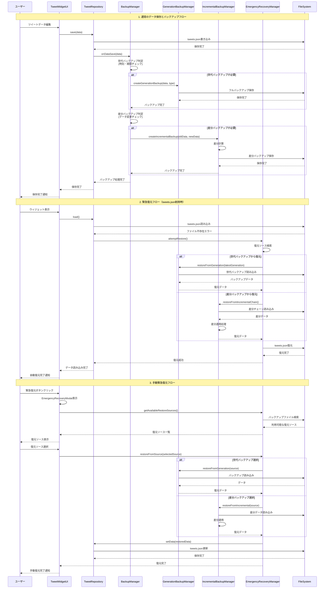

# バックアップシステムガイド

## 概要

TweetWidgetは包括的なデータ保護システムを提供しており、以下の機能を組み合わせてデータの安全性を確保しています：

- **世代バックアップ（Generation Backup）**: 定期的なフルデータスナップショット
- **差分バックアップ（Incremental Backup）**: 変更分のみを効率的に記録
- **緊急復元システム（Emergency Recovery）**: データ消失時の自動・手動復元
- **バージョン管理（Version Control）**: Git風の履歴管理

## システム構成

### 主要コンポーネント

```
BackupManager
├── GenerationBackupManager (世代バックアップ)
├── IncrementalBackupManager (差分バックアップ)
└── EmergencyRecoveryManager (緊急復元)
```

### ファイル構造

```
vault/
├── tweets.json                    # メインデータファイル
├── 040 STORAGE/
│   ├── backups/
│   │   ├── generations/           # 世代バックアップ
│   │   │   ├── daily/
│   │   │   ├── weekly/
│   │   │   └── monthly/
│   │   └── incremental/           # 差分バックアップ
│   └── tweet-data/
│       ├── db/                    # バージョン管理
│       └── versions/
```

## バックアップの種類

### 1. 世代バックアップ（Generation Backup）

**概要**: フルデータの定期スナップショット

**スケジュール**:
- **日次**: 毎日 02:00
- **週次**: 日曜日 02:30
- **月次**: 毎月1日 03:00

**特徴**:
- 完全なデータセットを保存
- 単独で完全復元が可能
- 長期保存に適している
- 復元が高速

**ファイル形式**:
```json
{
  "timestamp": "2024-01-15T02:00:00.000Z",
  "type": "daily",
  "data": { /* 完全なツイートデータ */ },
  "checksum": "sha256-hash",
  "metadata": {
    "totalTweets": 150,
    "dataSize": 45678
  }
}
```

### 2. 差分バックアップ（Incremental Backup）

**概要**: 変更分のみを効率的に記録

**実行タイミング**:
- データ保存時（変更がある場合のみ）
- リアルタイム保護

**特徴**:
- ストレージ効率が高い
- 全変更履歴を保持
- ベースバックアップ＋差分チェーンで復元
- 細かい変更も記録

**ファイル形式**:
```json
{
  "timestamp": "2024-01-15T10:30:00.000Z",
  "baseBackup": "generation-daily-2024-01-15",
  "diffs": [
    {
      "op": "add",
      "path": "/tweets/12345",
      "value": { /* 新しいツイート */ }
    },
    {
      "op": "replace",
      "path": "/tweets/12340/content",
      "value": "更新されたコンテンツ"
    }
  ],
  "checksum": "sha256-hash"
}
```

## 緊急復元システム

### 自動復元（Auto Recovery）

**トリガー**: `tweets.json`ファイルが存在しない場合

**処理フロー**:
1. ファイル不存在を検出
2. 復元ソースを自動検索
3. 最適な復元ソースを選択
4. 自動復元実行
5. ユーザーに通知

**復元優先順位**:
1. **高信頼度**: 最新の世代バックアップ
2. **中信頼度**: 最新の差分バックアップチェーン
3. **低信頼度**: 部分的なバックアップファイル

### 手動復元（Manual Recovery）

**アクセス方法**: デバッグモード時の「緊急復元」ボタン

**機能**:
- 利用可能な復元ソース一覧表示
- 信頼度アイコンによる視覚的な判別
- プレビュー機能
- 選択的復元

**復元ソース情報**:
- ファイル名・作成日時
- データサイズ・ツイート数
- 信頼度レベル
- 推奨度

## データ保護戦略

### 多層防御システム

1. **リアルタイム保護**: 差分バックアップで全変更を即座に記録
2. **定期保護**: 世代バックアップで安定した復元ポイントを提供
3. **緊急保護**: ファイル破損時の即座バックアップ
4. **履歴保護**: Git風バージョン管理で詳細な変更履歴

### データ整合性

- **チェックサム検証**: SHA-256ハッシュによるデータ整合性確認
- **メタデータ保存**: ファイルサイズ、ツイート数などの検証情報
- **破損検出**: 読み込み時の自動検証
- **自動修復**: 可能な場合の自動データ修復

## シーケンス図



## 設定とカスタマイズ

### バックアップ設定

```typescript
interface BackupConfig {
  // 世代バックアップ設定
  generation: {
    daily: { enabled: boolean; time: string };    // "02:00"
    weekly: { enabled: boolean; time: string };   // "02:30"
    monthly: { enabled: boolean; time: string };  // "03:00"
  };
  
  // 差分バックアップ設定
  incremental: {
    enabled: boolean;
    minChanges: number;        // 最小変更数
    maxBackups: number;        // 最大保持数
  };
  
  // 緊急復元設定
  emergency: {
    autoRestore: boolean;      // 自動復元の有効/無効
    showNotifications: boolean; // 通知表示
  };
}
```

### デバッグ機能

デバッグモードを有効にすると以下の機能が利用可能：

- **🔧 デバッグボタン**: バックアップ状況の詳細確認
- **💾 強制バックアップボタン**: 手動でバックアップ処理をテスト実行
- **🚨 緊急復元ボタン**: 手動復元UI表示

## トラブルシューティング

### よくある問題と解決方法

#### 1. バックアップが実行されない

**症状**: 設定した時刻になってもバックアップが作成されない

**原因と解決策**:
- プラグインが無効になっている → プラグインを有効にする
- 既に同じ期間のバックアップが存在 → 正常動作（重複作成されない）
- ファイルアクセス権限の問題 → Obsidianを管理者権限で実行

#### 2. 復元が失敗する

**症状**: 緊急復元時に「復元に失敗しました」エラー

**原因と解決策**:
- バックアップファイルが破損 → 別の復元ソースを選択
- パス設定の問題 → デバッグ機能でパスを確認
- ディスク容量不足 → 空き容量を確保

#### 3. パフォーマンスの問題

**症状**: バックアップ処理が重い

**解決策**:
- 差分バックアップの最大保持数を調整
- 古いバックアップファイルを手動削除
- SSDの使用を推奨

### ログ確認方法

デバッグモードでコンソールログを確認：

```javascript
// バックアップ状況の確認
console.log('=== バックアップ状況デバッグ ===');

// 強制バックアップの実行
console.log('強制バックアップ開始');
```

## 最佳实践

### データ保護のベストプラクティス

1. **定期的な確認**: 月1回はバックアップ状況をデバッグ機能で確認
2. **複数の復元手段**: 世代バックアップと差分バックアップの両方を有効にする
3. **外部バックアップ**: 重要なデータは追加で外部バックアップも推奨
4. **テスト復元**: 定期的に復元機能をテストする

### パフォーマンス最適化

1. **適切な保持期間**: 不要な古いバックアップは定期的に削除
2. **SSDの使用**: バックアップファイルはSSDに保存
3. **バックアップ時刻の調整**: システム使用量の少ない時間帯に設定

## 技術仕様

### 対応ファイル形式

- **メインデータ**: JSON形式
- **バックアップファイル**: JSON形式（圧縮対応）
- **差分データ**: JSON Patch形式（RFC 6902準拠）

### セキュリティ

- **チェックサム**: SHA-256ハッシュによる改ざん検出
- **アクセス制御**: Obsidian Vaultのアクセス権限に準拠
- **暗号化**: 将来的な実装予定

### パフォーマンス

- **差分計算**: O(n)の効率的なアルゴリズム
- **メモリ使用量**: 最小限のメモリフットプリント
- **並行処理**: 非同期処理によるUI応答性の確保

---

## 更新履歴

- **v1.0.0** (2024-01): 基本バックアップシステム実装
- **v1.1.0** (2024-01): 緊急復元システム追加
- **v1.2.0** (2024-01): 差分バックアップ機能強化
- **v1.3.0** (2024-01): 多言語対応、UI改善 