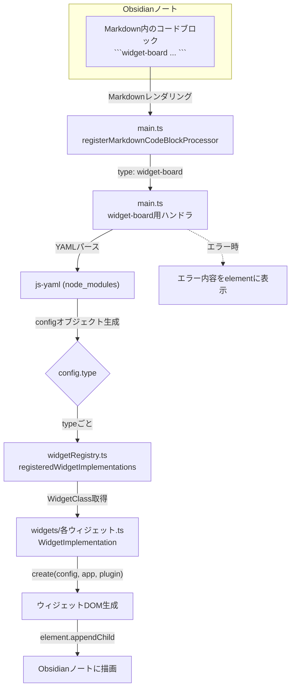

# Obsidian Widget Board Plugin: Markdownコードブロックでウィジェットを埋め込む方法

このドキュメントでは、ObsidianのMarkdownノート内でウィジェットを直接埋め込む方法について解説します。

---

## 機能概要

- Markdownのコードブロック（```widget-board）でウィジェットを埋め込めます
- コードブロック内はYAML形式で設定
- typeごとに既存のウィジェット（例: pomodoro, memo, tweet-widget など）を呼び出せます
- Obsidianの設定画面（settingsTab）で設定したグローバル値も自動で反映されます


---

## 基本的な使い方

### 1. Markdownに以下のように記述します

````markdown
```widget-board
type: pomodoro
title: "埋め込みポモドーロ"
settings:
  workMinutes: 25
  shortBreakMinutes: 5
  longBreakMinutes: 15
  pomodorosUntilLongBreak: 4
  backgroundImageUrl: "https://example.com/bg.jpg"
```
````

- `type`: ウィジェットの種類（必須）
- `title`: 表示タイトル（省略可）
- `settings`: 各ウィジェット固有の設定（省略可、未指定時はグローバル設定が反映）

---

## サンプル: 各ウィジェットの埋め込み例

### ポモドーロタイマー
````markdown
```widget-board
type: pomodoro
title: "集中タイマー"
settings:
  workMinutes: 50
  pomodoroNotificationSound: "bell"
```
````

### メモウィジェット
````markdown
```widget-board
type: memo
title: "埋め込みメモ"
settings:
  memoContent: "ここにメモ内容"
  memoHeightMode: auto
```
````

### つぶやきウィジェット
````markdown
```widget-board
type: tweet-widget
title: "埋め込みつぶやき"
settings:
  avatarUrl: "https://example.com/avatar.png"
```
````

### カレンダーウィジェット
````markdown
```widget-board
type: calendar
title: "埋め込みカレンダー"
```
````

---

## 設定の優先順位

- コードブロック内のYAMLで`settings`を指定した場合、その値が**最優先**されます
- `settings`を省略した場合、Obsidianの設定画面（settingsTab）で指定したグローバル値が自動で反映されます
- どちらにもない場合は、ウィジェットのデフォルト値が使われます

---

## エラー時の挙動

- YAMLのパースエラーやtype未対応時は、Markdown内にエラー内容が表示されます
- 例: `YAMLパースエラー: ...`、`未対応のウィジェットタイプ: ...` など

---

## よくある質問

### Q. `id`は必須ですか？
A. 省略可能です。自動で一意なIDが生成されます。

### Q. グローバル設定値を個別に上書きできますか？
A. `settings`で明示的に指定した値が優先されます。

### Q. どのtypeが使えますか？
A. `pomodoro`, `memo`, `calendar`, `tweet-widget`, `theme-switcher`, `timer-stopwatch`, `file-view-widget`, `reflection-widget` など。プラグインに登録されているtypeが利用可能です。

### Q. すべてのウィジェットでwidth/heightを指定できますか？
A. はい。`settings.width`や`settings.height`をYAMLで指定すると、ウィジェットの大きさを個別に調整できます。

---

## 詳細：ウィジェットごとのYAML設定key一覧

### 共通

- `type`（必須）: ウィジェットの種類
- `id`（省略可）: 識別子（省略時は自動生成）
- `title`（省略可）: 表示タイトル
- `settings`（省略可）: 各ウィジェット固有の設定
- `width`（省略可）: ウィジェットの幅（例: "320px", "60vw" など）
- `height`（省略可）: ウィジェットの高さ（例: "200px", "40vh" など）

> すべてのtypeで`settings.width`/`settings.height`が利用できます。

---

### type: pomodoro

| key                       | 説明                                 | 型      | 例                  |
|---------------------------|--------------------------------------|---------|---------------------|
| workMinutes               | 作業時間（分）                       | number  | 25                  |
| shortBreakMinutes         | 短い休憩時間（分）                   | number  | 5                   |
| longBreakMinutes          | 長い休憩時間（分）                   | number  | 15                  |
| pomodorosUntilLongBreak   | 長い休憩までのサイクル数             | number  | 4                   |
| backgroundImageUrl        | 背景画像URL                          | string  | https://...         |
| pomodoroNotificationSound | 通知音（グローバル設定が優先）       | string  | "bell"            |
| pomodoroNotificationVolume| 通知音量（0.0〜1.0, グローバル優先） | number  | 0.5                 |
| pomodoroExportFormat      | エクスポート形式                     | string  | "csv"             |

---

### type: memo

| key            | 説明                       | 型      | 例         |
|----------------|----------------------------|---------|------------|
| memoContent    | メモ内容（Markdown可）     | string  | "メモ"   |
| memoHeightMode | 高さモード（auto/fixed）   | string  | "auto"   |
| fixedHeightPx  | 固定高さ（px, fixed時のみ）| number  | 120        |

---

### type: tweet-widget

| key        | 説明                       | 型      | 例                        |
|------------|----------------------------|---------|---------------------------|
| avatarUrl  | ユーザーアイコンURL        | string  | https://.../avatar.png    |
| ...        | その他、つぶやき固有の設定 |         |                           |

---

### type: calendar
- 現状、個別設定項目なし

---

### type: timer-stopwatch

| key                        | 説明                                 | 型      | 例         |
|----------------------------|--------------------------------------|---------|------------|
| timerMinutes               | タイマー初期値（分）                 | number  | 5          |
| timerSeconds               | タイマー初期値（秒）                 | number  | 0          |
| notificationSound          | 通知音（グローバル設定が優先）       | string  | "bell"   |
| notificationVolume         | 通知音量（0.0〜1.0, グローバル優先） | number  | 0.5        |

---

### type: file-view-widget

| key           | 説明                       | 型      | 例         |
|---------------|----------------------------|---------|------------|
| heightMode    | 高さモード（auto/fixed）   | string  | "auto"   |
| fixedHeightPx | 固定高さ（px, fixed時のみ）| number  | 200        |

---

### type: reflection-widget

| key                        | 説明                                 | 型      | 例         |
|----------------------------|--------------------------------------|---------|------------|
| aiSummaryAutoEnabled       | AIまとめ自動発火ON/OFF               | boolean | true       |
| aiSummaryAutoIntervalHours | 自動発火の間隔（時間, -1で無効）     | number  | 2          |
| aiSummaryManualEnabled     | 手動発火ボタン表示ON/OFF             | boolean | true       |

---

## YAML記述例

````markdown
```widget-board
type: pomodoro
title: "集中タイマー"
settings:
  workMinutes: 50
  pomodoroNotificationSound: "bell"
  backgroundImageUrl: "https://example.com/bg.jpg"
```
````

---

## 注意事項

- コードブロックのYAMLはインデントや記法ミスに注意してください
- typeや設定値はプラグインのバージョンによって追加・変更される場合があります

何か不明点や要望があれば、IssueやREADMEまでご連絡ください。

---

## YAML設定keyを拡張したい場合

各ウィジェットtypeごとのYAML設定keyを拡張したい場合は、**該当ウィジェットのTypeScriptファイル**（例: `src/widgets/pomodoro/index.ts` など）で、以下の箇所を修正してください。

### 1. 型定義の拡張
- `PomodoroSettings`や`MemoWidgetSettings`など、各ウィジェットの設定型に新しいkeyを追加します。

```ts
// 例: src/widgets/pomodoro/index.ts
export interface PomodoroSettings {
    workMinutes: number;
    shortBreakMinutes: number;
    // ...既存
    newOption?: string; // ← 追加
}
```

### 2. デフォルト値の追加
- `DEFAULT_POMODORO_SETTINGS`などのデフォルト設定オブジェクトに新keyを追加します。

```ts
export const DEFAULT_POMODORO_SETTINGS: PomodoroSettings = {
    workMinutes: 25,
    shortBreakMinutes: 5,
    // ...既存
    newOption: "defaultValue", // ← 追加
};
```

### 3. ウィジェット本体での利用
- `this.settings.newOption` のように、ウィジェットのロジック内で新keyを参照・利用します。

### 4. Markdown埋め込みでの利用
- 上記の型・デフォルト値を拡張すれば、MarkdownのYAMLで新しいkeyをそのまま使えるようになります。

```widget-board
type: pomodoro
settings:
  newOption: "新しい値"
```


---

**まとめ:**
- YAMLで使えるkeyを拡張したい場合は、該当ウィジェットのTypeScriptファイルの「設定型」「デフォルト値」「ロジック」を修正してください。
- 追加したkeyは自動的にYAMLでも利用可能になります。

---

## 実装の流れ（Mermaid図）



### 主な関係ファイル・関数
- `src/main.ts` : コードブロックプロセッサ登録・YAMLパース・ウィジェット呼び出し
- `src/widgetRegistry.ts` : type名→WidgetClassのマッピング
- `src/widgets/各ウィジェット.ts` : 各WidgetImplementation（create関数）
- `node_modules/js-yaml` : YAMLパース

---

## さらなる考察: Markdown埋め込みの内部構造

ここでは、MarkdownレンダリングからウィジェットDOM生成に至る処理をより詳細に解説
します。学術研究等で高度なカスタマイズを行う際の参考としてご活用ください。

### Markdownレンダリングからウィジェット生成まで
1. ObsidianはMarkdownをHTMLへ変換する際、コードブロックに対し
   `registerMarkdownCodeBlockProcessor` で登録された処理を呼び出します。
2. `widget-board` ブロックが検出されると、`src/main.ts` のハンドラがYAMLテキストを
   `js-yaml`で解析し、設定オブジェクトを生成します。
3. `src/widgetRegistry.ts` で type 名に対応する `WidgetImplementation` が解決され、
   その `create()` メソッドが実行されます。
4. 各ウィジェット実装は `HTMLElement` を返し、これがMarkdown内に直接挿入されます。

### YAMLスキーマとバリデーション
- 各ウィジェットの設定型（例: `PomodoroSettings`）が事実上のスキーマとなります。
- より厳密な検証が必要な場合、`zod` などのスキーマ定義ライブラリを導入すると
  入力バリデーションを体系的に管理できます。
- YAML構造を明示的に検証することで、想定外入力によるレンダリングエラーを防止
  できます。

### セキュリティ上の留意点
- YAML内で指定する外部リソース（画像URLなど）は信頼できるものか確認してください。
- 本プラグインは任意のJavaScript実行を想定していませんが、将来的に機能拡張する
  場合はXSS対策が必須となります。
- 生成されるログファイルや設定情報が外部に漏洩しないよう、ファイルアクセス権限も
  適切に管理してください。

### 学術研究向け利用例
- メモウィジェットを研究ノートの入力インターフェースとして利用し、ポモドーロログ
  と統合して作業効率を分析する、といった応用が可能です。
- Reflection Widget に独自のAI要約ロジックを接続し、学習記録を自動解析する例も
  考えられます。
- このように、Markdown埋め込み機構を基盤として多様な研究用途へ展開できます。
