```mermaid
flowchart TD
  %% クラス・主要データ
  Widget["TweetWidget (main class)"]
  UI["TweetWidgetUI"]
  Store["TweetStore"]
  Repo["TweetRepository"]
  AiReply["aiReply (generateAiReply, shouldAutoReply, etc)"]
  Utils["tweetWidgetUtils (parseTags, parseLinks, formatTimeAgo, readFileAsDataUrl, wrapSelection)"]
  Types["types (TweetWidgetPost, TweetWidgetSettings, etc)"]
  Constants["constants (MAX_TWEET_LENGTH, DEFAULT_TWEET_WIDGET_SETTINGS)"]
  Gemini["GeminiProvider (LLM API)"]
  Notice["Notice (Obsidian)"]
  Plugin["WidgetBoardPlugin"]
  App["App (Obsidian)"]

  %% 初期化
  Widget -- create() --> Repo
  Widget -- create() --> Store
  Widget -- create() --> UI
  Widget -- create() --> Plugin
  Widget -- create() --> App

  %% 投稿・編集・削除・リアクション
  Widget -- submitPost/submitReply --> Store
  Widget -- submitPost/submitReply --> Utils
  Widget -- submitPost/submitReply --> triggerAiReply
  Widget -- submitPost/submitReply --> UI
  Widget -- submitPost/submitReply --> Notice

  Widget -- startEdit/startReply/cancelReply --> UI
  Widget -- toggleLike/toggleRetweet/toggleBookmark --> Store
  Widget -- toggleLike/toggleRetweet/toggleBookmark --> UI
  Widget -- setPostDeleted/deletePost/deleteThread --> Store
  Widget -- setPostDeleted/deletePost/deleteThread --> UI

  %% AIリプライ
  Widget -- triggerAiReply --> AiReply
  AiReply -- generateAiReply --> Gemini
  AiReply -- generateAiReply --> Utils
  AiReply -- generateAiReply --> Store
  AiReply -- generateAiReply --> Widget(saveReply)
  AiReply -- shouldAutoReply --> Store

  Widget -- generateGeminiReply --> Gemini
  Widget -- generateGeminiReply --> Utils
  Widget -- generateGeminiReply --> AiReply
  Widget -- generateGeminiReply --> Store
  Widget -- generateGeminiReply --> UI

  %% ファイル添付
  Widget -- attachFiles --> Utils

  %% フィルタ・タブ・期間
  Widget -- setFilter/setPeriod/setCustomPeriodDays/switchTab --> UI
  Widget -- getFilteredPosts --> Store

  %% ContextNote
  Widget -- openContextNote --> App
  Widget -- openContextNote --> Store
  Widget -- openContextNote --> Notice

  %% データ保存
  Widget -- saveDataDebounced --> Repo

  %% UI連携
  UI -- render/renderFilePreview/scheduleRender --> Widget
  UI -- render --> Store
  UI -- render --> Utils
  UI -- render --> Types

  %% 型・定数
  Widget -- 型利用 --> Types
  Widget -- 定数利用 --> Constants

  %% 外部
  Widget -- Notice --> Notice
  Widget -- App --> App
  Widget -- Plugin --> Plugin

```

```
src/widgets/tweetWidget/
├── aiReply.ts
├── constants.ts
├── TweetRepository.ts
├── TweetStore.ts
├── tweetWidget.ts
├── tweetWidgetAiDb.ts
├── tweetWidgetDataViewer.ts
├── tweetWidgetUI.ts
├── tweetWidgetUtils.ts
└── types.ts

```



---

### 1. **aiReply.ts**
**役割**: AI（Gemini等）による自動リプライ生成のロジックを集約。

- **generateAiReply**: Gemini APIを使い、スレッド履歴や設定をもとにAIリプライを生成し、投稿オブジェクトとして返す。APIレスポンスがJSON形式の場合もパース。
- **shouldAutoReply**: 投稿内容やタグ、ガバナンス設定（1分/1日あたりの回数制限）をもとに自動リプライ発火可否を判定。
- **getFullThreadHistory**: 指定投稿からスレッドのルートまで遡り、履歴を配列で返す。
- **findLatestAiUserIdInThread**: スレッド内で直近のAIユーザーIDを探索。
- **isExplicitAiTrigger**: 投稿本文やタグにAIリプライの明示的トリガー（@aiやai-replyタグ）が含まれるか判定。
- **generateAiUserId**: 新しいAIユーザーID（@ai-xxxxxx形式）を生成。

**使われ方**: TweetWidget本体からAIリプライが必要なときに呼び出され、生成されたリプライは投稿リストに追加される。

---

### 2. **constants.ts**
**役割**: TweetWidgetで使う定数を集約。

- **DEFAULT_TWEET_WIDGET_SETTINGS**: 投稿リストやユーザー名などのデフォルト設定。
- **MAX_TWEET_LENGTH**: 投稿の最大文字数（例: 300文字）。

**使われ方**: 各種初期化やバリデーション、UI表示などで参照される。

---

### 3. **TweetRepository.ts**
**役割**: 投稿・設定データの永続化・読み込みを担うリポジトリ層。

- **TweetRepositoryクラス**: Obsidian Vault APIを使い、ファイルへの保存・読み込みを行う。load/saveメソッドでJSONデータをやりとり。
- **validatePost**: 読み込んだデータのバリデーションも担う。

**使われ方**: TweetWidget本体やストアから呼び出され、データの永続化・復元を担う。

---

### 4. **TweetStore.ts**
**役割**: 投稿や設定の状態管理（ストア）を担うクラス。

- **TweetStoreクラス**: 投稿リスト・設定の保持、IDからの検索、投稿の追加・更新・削除、スレッドごとの削除などのメソッドを持つ。
- **postsById**: 投稿ID→投稿オブジェクトのMapを管理。

**使われ方**: TweetWidget本体から状態管理のために利用される。UIやリポジトリ層と連携。

---

### 5. **tweetWidget.ts**
**役割**: TweetWidget本体のクラス定義。ウィジェット全体のコントローラーとして、UI・状態管理・データ永続化・AIリプライ・ファイル添付・各種ユーザー操作を統括。

- **TweetWidgetクラス**: ObsidianのWidgetImplementationを実装し、以下の責務を持つ。
  - UI初期化・再描画（TweetWidgetUIと連携）
  - 投稿・設定データの状態管理（TweetStoreと連携）
  - 投稿・設定データの永続化（TweetRepositoryと連携）
  - 投稿・返信・編集・削除・リアクション（いいね/リツイート/ブックマーク）・スレッド削除・ContextNote作成・期間/フィルタ/タブ切替などのユーザー操作を管理
  - AIリプライ（Gemini等）自動発火・明示発火・ガバナンス制御（aiReply.tsと連携）
  - ファイル添付・DataURL変換
  - 投稿の期間・フィルタ・タブ（home/notification）切替
  - アバター画像の管理（AIユーザーIDごとに分散）

- **主なメソッド・機能**:
  - `create`: 初期化・UI描画・データロード
  - `submitPost`/`submitReply`: 投稿・返信の追加、AIリプライのトリガー
  - `startEdit`/`startReply`/`cancelReply`: 編集・返信モード切替
  - `toggleLike`/`toggleRetweet`/`toggleBookmark`: リアクション操作
  - `setPostDeleted`/`deletePost`/`deleteThread`: 投稿・スレッド削除
  - `openContextNote`: 投稿からContextNote（mdファイル）を自動生成・オープン
  - `generateGeminiReply`: Gemini APIを使ったAIリプライ生成（手動）
  - `getFilteredPosts`: 期間・フィルタに応じた投稿リスト取得
  - `getAvatarUrl`: 投稿・ユーザーごとのアバターURL取得
  - `setPeriod`/`setCustomPeriodDays`: 期間絞り込みの設定
  - `attachFiles`: ファイル添付・DataURL変換

- **依存関係**:
  - `TweetWidgetUI`（UI描画・イベント処理）
  - `TweetStore`（状態管理）
  - `TweetRepository`（データ永続化）
  - `aiReply.ts`（AIリプライ生成・ガバナンス）
  - `tweetWidgetUtils.ts`（タグ抽出・リンク抽出・日付整形・ファイル変換等）
  - `types.ts`（型定義）
  - `constants.ts`（定数）

**使われ方**: Obsidianのウィジェットとして登録され、ユーザーの操作やデータ管理・AI連携・ファイル添付・ContextNote連携などTweetWidget全体の中核を担う。

---

### 6. **tweetWidgetAiDb.ts**
**役割**: AIデータベース関連の処理を集約。

**使われ方**: AIリプライ生成やデータベース操作に関連する処理を行う。

---

### 7. **tweetWidgetDataViewer.ts**
**役割**: データビューア関連の処理を集約。

**使われ方**: データビューア関連の処理を行う。

---

### 8. **tweetWidgetUI.ts**
**役割**: TweetWidgetのUI描画・イベント処理を集約。

- **TweetWidgetUIクラス**: DOM操作、ボタンや入力欄の描画、ユーザー操作への反応、リプライモーダルや通知タブの描画など。
- **UIイベントのハンドリング**: 投稿・編集・削除・リアクション・ブックマーク・AIリプライボタンなどの操作を管理。
- **Markdown描画やファイルプレビューも担当**。

**使われ方**: TweetWidget本体からUI描画・再描画のために呼び出される。

---

### 9. **tweetWidgetUtils.ts**
**役割**: TweetWidgetで使う汎用的なユーティリティ関数を集約。

- **parseTags/parseLinks**: 投稿本文からタグやリンクを抽出。
- **formatTimeAgo**: 日付を「○分前」などの形式に変換。
- **readFileAsDataUrl**: ファイルをDataURLに変換。
- **wrapSelection**: テキストエリアの選択範囲をラップ。
- **validatePost**: 投稿データのバリデーション。

**使われ方**: 本体やUI、リポジトリ層など様々な箇所で再利用される。

---

### 10. **types.ts**
**役割**: TweetWidgetで使う型定義（インターフェース）を集約。

- **TweetWidgetPost**: 投稿データの型。
- **TweetWidgetSettings**: 設定・全投稿リストの型。
- **TweetWidgetFile**: 添付ファイルの型。

**使われ方**: すべてのTypeScriptファイルで型安全のためにimportされる。

---


