```mermaid

graph TD
  %% types.ts
  types["types.ts"]
  TweetWidgetPost["TweetWidgetPost"]
  TweetWidgetSettings["TweetWidgetSettings"]
  TweetWidgetFile["TweetWidgetFile"]
  types --> TweetWidgetPost
  types --> TweetWidgetSettings
  types --> TweetWidgetFile

  %% constants.ts
  constants["constants.ts"]
  constants --> DEFAULT_TWEET_WIDGET_SETTINGS
  constants --> MAX_TWEET_LENGTH
  constants --> types

  %% tweetWidgetUtils.ts
  utils["tweetWidgetUtils.ts"]
  utils --> parseTags
  utils --> parseLinks
  utils --> formatTimeAgo
  utils --> readFileAsDataUrl
  utils --> wrapSelection
  utils --> validatePost
  utils --> types

  %% tweetWidgetDb.ts
  db["tweetWidgetDb.ts"]
  db --> loadTweetsFromFile
  db --> saveTweetsToFile
  db --> types
  db --> utils

  %% tweetWidgetAiDb.ts
  aiDb["tweetWidgetAiDb.ts"]
  aiDb --> aiDbFunction1
  aiDb --> types

  %% TweetStore.ts
  store["TweetStore.ts"]
  store --> TweetStoreClass
  store --> types
  store --> utils

  %% TweetRepository.ts
  repo["TweetRepository.ts"]
  repo --> TweetRepositoryClass
  repo --> validatePost
  repo --> db
  repo --> constants
  repo --> types

  %% aiReply.ts
  aiReply["aiReply.ts"]
  aiReply --> generateAiReply
  aiReply --> shouldAutoReply
  aiReply --> getFullThreadHistory
  aiReply --> findLatestAiUserIdInThread
  aiReply --> isExplicitAiTrigger
  aiReply --> generateAiUserId
  aiReply --> types
  aiReply --> utils
  aiReply --> aiDb

  %% tweetWidgetUI.ts
  ui["tweetWidgetUI.ts"]
  ui --> TweetWidgetUIClass
  ui --> parseTags
  ui --> parseLinks
  ui --> formatTimeAgo
  ui --> types
  ui --> utils

  %% tweetWidget.ts
  widget["tweetWidget.ts"]
  widget --> TweetWidgetClass
  widget --> TweetWidgetUIClass
  widget --> TweetStoreClass
  widget --> TweetRepositoryClass
  widget --> generateAiReply
  widget --> shouldAutoReply
  widget --> findLatestAiUserIdInThread
  widget --> getFullThreadHistory
  widget --> generateAiUserId
  widget --> isExplicitAiTrigger
  widget --> parseTags
  widget --> parseLinks
  widget --> formatTimeAgo
  widget --> readFileAsDataUrl
  widget --> wrapSelection
  widget --> DEFAULT_TWEET_WIDGET_SETTINGS
  widget --> MAX_TWEET_LENGTH
  widget --> types
  widget --> constants
  widget --> utils
  widget --> repo
  widget --> store
  widget --> aiReply
  widget --> ui

```

```
src/widgets/tweetWidget/
├── aiReply.ts
├── constants.ts
├── TweetRepository.ts
├── TweetStore.ts
├── tweetWidget.ts
├── tweetWidgetAiDb.ts
├── tweetWidgetDb.ts
├── tweetWidgetUI.ts
├── tweetWidgetUtils.ts
└── types.ts

```



---

### 1. **aiReply.ts**
**役割**: AI（Gemini等）による自動リプライ生成のロジックを集約。

- **generateAiReply**: Gemini APIを使い、スレッド履歴や設定をもとにAIリプライを生成し、投稿オブジェクトとして返す。APIレスポンスがJSON形式の場合もパース。
- **shouldAutoReply**: 投稿内容やタグ、ガバナンス設定（1分/1日あたりの回数制限）をもとに自動リプライ発火可否を判定。
- **getFullThreadHistory**: 指定投稿からスレッドのルートまで遡り、履歴を配列で返す。
- **findLatestAiUserIdInThread**: スレッド内で直近のAIユーザーIDを探索。
- **isExplicitAiTrigger**: 投稿本文やタグにAIリプライの明示的トリガー（@aiやai-replyタグ）が含まれるか判定。
- **generateAiUserId**: 新しいAIユーザーID（@ai-xxxxxx形式）を生成。
- **内部ガバナンス用マップ**: 1分/1日あたりのAIリプライ回数を管理。

**使われ方**: TweetWidget本体からAIリプライが必要なときに呼び出され、生成されたリプライは投稿リストに追加される。

---

### 2. **constants.ts**
**役割**: TweetWidgetで使う定数を集約。

- **DEFAULT_TWEET_WIDGET_SETTINGS**: 投稿リストやユーザー名などのデフォルト設定。
- **MAX_TWEET_LENGTH**: 投稿の最大文字数（例: 300文字）。

**使われ方**: 各種初期化やバリデーション、UI表示などで参照される。

---

### 3. **TweetRepository.ts**
**役割**: 投稿・設定データの永続化・読み込みを担うリポジトリ層。

- **TweetRepositoryクラス**: Obsidian Vault APIを使い、ファイルへの保存・読み込みを行う。load/saveメソッドでJSONデータをやりとり。
- **validatePost**: 読み込んだデータのバリデーションも担う。

**使われ方**: TweetWidget本体やストアから呼び出され、データの永続化・復元を担う。

---

### 4. **TweetStore.ts**
**役割**: 投稿や設定の状態管理（ストア）を担うクラス。

- **TweetStoreクラス**: 投稿リスト・設定の保持、IDからの検索、投稿の追加・更新・削除、スレッドごとの削除などのメソッドを持つ。
- **postsById**: 投稿ID→投稿オブジェクトのMapを管理。

**使われ方**: TweetWidget本体から状態管理のために利用される。UIやリポジトリ層と連携。

---

### 5. **tweetWidget.ts**
**役割**: TweetWidget本体のクラス定義。ウィジェット全体のコントローラー。

- **TweetWidgetクラス**: UI初期化、データ管理、ユーザー操作、AIリプライ呼び出し、ファイル添付、各種トグル・削除・編集などのメソッドを持つ。
- **UI/ストア/リポジトリの連携**: UI層・ストア層・リポジトリ層を束ねる。
- **ObsidianのWidgetImplementationを実装**。

**使われ方**: Obsidianのウィジェットとして登録され、ユーザーの操作やデータ管理の中心となる。

---

### 6. **tweetWidgetAiDb.ts**
**役割**: AI関連のデータベース操作（AIリプライ履歴など）を扱う。

- **AIリプライの履歴管理**: AIリプライの発火履歴やガバナンス用のデータ保存・取得。
- **AIリプライの回数制限や履歴参照**。

**使われ方**: aiReply.tsや本体からAIリプライのガバナンス・履歴参照時に利用。

---

### 7. **tweetWidgetDb.ts**
**役割**: 投稿データのファイル保存・読み込みの低レベルなユーティリティ。

- **loadTweetsFromFile / saveTweetsToFile**: Obsidian Vault APIを使い、JSONデータの読み書きを行う。
- **バリデーションや初期化も一部担当**。

**使われ方**: TweetRepositoryや本体から呼び出され、データの永続化・復元を担う。

---

### 8. **tweetWidgetUI.ts**
**役割**: TweetWidgetのUI描画・イベント処理を集約。

- **TweetWidgetUIクラス**: DOM操作、ボタンや入力欄の描画、ユーザー操作への反応、リプライモーダルや通知タブの描画など。
- **UIイベントのハンドリング**: 投稿・編集・削除・リアクション・ブックマーク・AIリプライボタンなどの操作を管理。
- **Markdown描画やファイルプレビューも担当**。

**使われ方**: TweetWidget本体からUI描画・再描画のために呼び出される。

---

### 9. **tweetWidgetUtils.ts**
**役割**: TweetWidgetで使う汎用的なユーティリティ関数を集約。

- **parseTags/parseLinks**: 投稿本文からタグやリンクを抽出。
- **formatTimeAgo**: 日付を「○分前」などの形式に変換。
- **readFileAsDataUrl**: ファイルをDataURLに変換。
- **wrapSelection**: テキストエリアの選択範囲をラップ。
- **validatePost**: 投稿データのバリデーション。

**使われ方**: 本体やUI、リポジトリ層など様々な箇所で再利用される。

---

### 10. **types.ts**
**役割**: TweetWidgetで使う型定義（インターフェース）を集約。

- **TweetWidgetPost**: 投稿データの型。
- **TweetWidgetSettings**: 設定・全投稿リストの型。
- **TweetWidgetFile**: 添付ファイルの型。

**使われ方**: すべてのTypeScriptファイルで型安全のためにimportされる。

---


